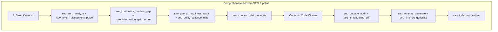

# 🚀 SEO Gravity MCP: The Next-Gen SEO, GEO & Competitor Intelligence Suite for Antigravity

> **A comprehensive Model Context Protocol (MCP) server, Antigravity plugin, and automated SEO/GEO intelligence engine.**
> Empowering Antigravity with live SERP scraping, competitor reverse-engineering, Generative Engine Optimization (GEO/AEO), Google Information Gain scoring, E-E-A-T analysis, JavaScript SEO hydration diffing, entity salience mapping, keyword clustering, IndexNow instant indexing, and Schema.org markup generation—**with zero required paid API subscriptions**.

---

## 📑 Table of Contents
1. [Executive Summary](#1-executive-summary)
2. [Modern Architecture & System Design](#2-modern-architecture--system-design)
3. [The 8 Pillars of Modern SEO & Complete Tool Catalog (28 Tools)](#3-the-8-pillars-of-modern-seo--complete-tool-catalog)
   - [Pillar 1: Competitor Intelligence & SERP Analysis](#pillar-1-competitor-intelligence--serp-analysis)
   - [Pillar 2: GEO & AI Search Optimization (AEO / LLM Visibility)](#pillar-2-geo--ai-search-optimization-aeo--llm-visibility)
   - [Pillar 3: Google Information Gain & E-E-A-T Scoring](#pillar-3-google-information-gain--e-e-a-t-scoring)
   - [Pillar 4: On-Page SEO & Content Strategy](#pillar-4-on-page-seo--content-strategy)
   - [Pillar 5: Technical SEO & JavaScript Hydration](#pillar-5-technical-seo--javascript-hydration)
   - [Pillar 6: Keyword Research & Intent Clustering](#pillar-6-keyword-research--intent-clustering)
   - [Pillar 7: Entity Salience & Schema Knowledge Graph](#pillar-7-entity-salience--schema-knowledge-graph)
   - [Pillar 8: Performance, Instant Indexing & Content Freshness](#pillar-8-performance-instant-indexing--content-freshness)
4. [Autonomous SEO Workflows & Pipelines](#4-autonomous-seo-workflows--pipelines)
5. [Antigravity Integration (`mcp_config.json` & `SKILL.md`)](#5-antigravity-integration)
6. [Data Sources & Zero-Cost Architecture](#6-data-sources--zero-cost-architecture)
7. [Implementation & File Structure](#7-implementation--file-structure)

---

## 1. Executive Summary

Search Engine Optimization (SEO) in 2025–2026 has fundamentally shifted:
1. **Search is now multimodal and AI-synthesized**: Google AI Overviews, Perplexity.ai, and ChatGPT Search summarize web content before users ever click.
2. **Generic AI fluff is penalized**: Google's *Information Gain* algorithm rewards content that introduces novel data, first-hand expertise, and unique frameworks.
3. **Discussions and Communities dominate SERPs**: Google heavily indexes Reddit, Quora, and forum threads.
4. **Modern web apps rely on heavy Client-Side JavaScript**: SSR vs CSR hydration mismatches cause silent crawling failures.

**SEO Gravity MCP** transforms Antigravity into an autonomous SEO strategist, technical auditor, and GEO optimizer capable of navigating both traditional search and generative AI engines.

---

## 2. Modern Architecture & System Design

```
+-------------------------------------------------------------------------+
|                           ANTIGRAVITY IDE                               |
|                                                                         |
|  +-----------------------+               +---------------------------+  |
|  |   Antigravity Agent   | <-----------> |    SEO Mastery Skill      |  |
|  |     (Planner/LLM)     |               |    (Autonomous Runbooks)  |  |
|  +-----------------------+               +---------------------------+  |
|              ^                                                          |
|              | JSON-RPC over stdio                                      |
|              v                                                          |
+-------------------------------------------------------------------------+
|                     SEO GRAVITY MCP SERVER                              |
|                                                                         |
|  +-------------------------------------------------------------------+  |
|  |                  MCP Request Dispatcher & Router                  |  |
|  +-------------------------------------------------------------------+  |
|                                  |                                      |
|       +--------------------------+--------------------------+           |
|       |         |        |         |        |       |       |           |
|       v         v        v         v        v       v       v           |
|  +--------+ +------+ +-------+ +-------+ +------+ +---+ +-------+       |
|  | SERP & | | GEO  | |E-E-A-T| |On-Page| |Tech &| |Key| |Schema &|       |
|  | Compet.| |  AI  | | Info  | |Content| |  JS  | |word| | Entity |       |
|  | Engine | |Engine| | Gain  | |Engine | |Engine| |   | | Graph |       |
|  +--------+ +------+ +-------+ +-------+ +------+ +---+ +-------+       |
|       |         |        |         |        |       |       |           |
|       +---------+--------+---------+--------+-------+-------+           |
|                                  |                                      |
|  +-------------------------------------------------------------------+  |
|  |                     Data Fetchers & Core Utilities                |  |
|  |  - Cheerio / Fast HTML Parser       - Google Autocomplete / PAA   |  |
|  |  - User-Agent Rotation Scraper      - Natural / TF-IDF / Triples  |  |
|  |  - JSDOM Hydration Differentiator   - IndexNow Protocol Dispatch  |  |
|  |  - XML Sitemap & Robots Parser      - Google PageSpeed / CWV      |  |
|  |  - Optional: DataForSEO / Semrush / Ahrefs / Google Search Console |  |
|  +-------------------------------------------------------------------+  |
+-------------------------------------------------------------------------+
```

---

## 3. The 8 Pillars of Modern SEO & Complete Tool Catalog

### Pillar 1: Competitor Intelligence & SERP Analysis

#### 1. `seo_serp_analyze`
- **Description**: Scrapes live Google SERP for a target query.
- **Parameters**: `query` (string), `country` (string, default: `"us"`), `language` (string, default: `"en"`), `num_results` (number, default: `10`).
- **Output**: Organic ranks, URLs, titles, meta snippets, People Also Ask (PAA) questions, Related Searches, and SERP features (Featured Snippet, Knowledge Panel, Video Carousels).

#### 2. `seo_competitor_content_gap`
- **Description**: Reverse-engineers top 3–5 competitor pages vs your target URL/draft to find missing TF-IDF entities, subtopics, and questions.
- **Parameters**: `target_url_or_text` (string), `target_keyword` (string), `competitor_urls` (array of strings, optional).
- **Output**: Missing entities list, heading gaps (H2/H3s), word count comparison, and suggested outline additions.

#### 3. `seo_competitor_profile`
- **Description**: Deep extraction of a competitor's technical structure, heading tree, schema markup, and backlink proxy attributes.
- **Parameters**: `url` (string).
- **Output**: Full outline, schema types, word count, reading level, OpenGraph tags, canonicals, and link ratio.

#### 4. `seo_competitor_diff`
- **Description**: 25+ factor side-by-side scorecard matrix between your URL and a competitor URL.
- **Parameters**: `my_url` (string), `competitor_url` (string), `focus_keyword` (string).
- **Output**: Comparative scorecard with category winners (Content Depth, Technical Hygiene, Keyword Prominence).

#### 5. `seo_forum_discussions_pulse`
- **Description**: Discovers Reddit, Quora, and forum discussions ranking on Google for a query, extracting user sentiment, common problems, and consensus.
- **Parameters**: `topic_or_keyword` (string).
- **Output**: Ranking Reddit/forum threads, top upvoted questions, recurring complaints, and user recommendations.

---

### Pillar 2: GEO & AI Search Optimization (AEO / LLM Visibility)

#### 6. `seo_geo_ai_readiness_audit`
- **Description**: Scores content for citation probability in Google AI Overviews, Perplexity.ai, and ChatGPT Search.
- **Parameters**: `url_or_text` (string), `target_query` (string).
- **Evaluates**:
  - Direct answer formatting (bolded definitions, concise answer summaries in first 50 words).
  - Semantic chunking (self-contained subsections with explicit context).
  - Structured tables & bullet points.
  - Quotable authoritative statistics and cited research.
- **Output**: GEO Score (0–100), AI Citation Potential rating, and specific rewrite suggestions for AI answer boxes.

#### 7. `seo_llms_txt_generate`
- **Description**: Generates or validates clean `/llms.txt` and `/llms-full.txt` files to guide AI search bots to key site documentation and resources.
- **Parameters**: `site_name` (string), `site_description` (string), `key_pages` (array of objects with title, url, description).
- **Output**: Spec-compliant `llms.txt` and `llms-full.txt` markdown files.

#### 8. `seo_ai_bots_robots_audit`
- **Description**: Checks `robots.txt` permissions specifically for generative AI bots (`GPTBot`, `ClaudeBot`, `PerplexityBot`, `Google-Extended`, `Bytespider`, `Applebot-Extended`).
- **Parameters**: `domain_or_url` (string).
- **Output**: AI crawler allowance matrix, training consent status, and suggested directive optimizations.

---

### Pillar 3: Google Information Gain & E-E-A-T Scoring

#### 9. `seo_information_gain_score`
- **Description**: Evaluates the novelty and unique value of your content against top-ranking SERP competitors (Google Information Gain Patent).
- **Parameters**: `my_content_or_url` (string), `keyword` (string).
- **Checks**:
  - Unique data points, case studies, proprietary statistics, and quotes not found in competitor texts.
  - "Fluff Factor": percentage of generic rephrased AI content vs original substance.
- **Output**: Information Gain Score (0–100), Unique Entity Delta, and recommended unique elements to add.

#### 10. `seo_eeat_audit`
- **Description**: Inspects Google E-E-A-T (Experience, Expertise, Authoritativeness, Trustworthiness) trust signals on a page.
- **Parameters**: `url_or_html` (string).
- **Checks**:
  - Author byline with linked `Person` schema and authoritative `sameAs` links (LinkedIn, Wikidata, Wikipedia).
  - Editorial policy & fact-checking disclaimers.
  - Publication & last-modified timestamps.
  - Customer review schema & trust badges.
- **Output**: E-E-A-T Trust Score, checklist gaps, and recommended schema enhancements.

---

### Pillar 4: On-Page SEO & Content Strategy

#### 11. `seo_onpage_audit`
- **Description**: Audits title pixel width, meta description CTR, heading nesting, image alt tags, keyword density, and URL slug format.
- **Parameters**: `url` (optional), `html_content` (optional), `focus_keyword` (optional).
- **Output**: Categorized error/warning/pass report with actionable code fixes.

#### 12. `seo_content_brief_generate`
- **Description**: Generates an exhaustive, intent-optimized Content Brief for writers or agents.
- **Parameters**: `primary_keyword` (string), `secondary_keywords` (array of strings), `search_intent` (string).
- **Output**: Target word count, H1/H2/H3 outline, semantic entity checklist, and PAA FAQ section.

#### 13. `seo_readability_score`
- **Description**: Computes Flesch-Kincaid, Gunning Fog, and sentence complexity metrics.
- **Parameters**: `text_or_url` (string).
- **Output**: Readability score, average sentence length, passive voice %, and suggested simplifications.

---

### Pillar 5: Technical SEO & JavaScript Hydration

#### 14. `seo_technical_audit`
- **Description**: Validates status codes, redirect chains, canonical tags, meta robots, hreflang, and SSL certificates.
- **Parameters**: `url` (string).
- **Output**: Technical health report with severity-graded issues.

#### 15. `seo_js_rendering_diff`
- **Description**: Diffs the raw server HTML response against the hydrated client DOM (JavaScript SEO).
- **Parameters**: `url` (string).
- **Detects**:
  - Links and text only rendered after JavaScript execution.
  - Meta tags or canonical tags dynamically rewritten by client-side JS.
  - Hydration mismatches that break crawler indexing.
- **Output**: Diff breakdown of server vs client HTML, flagged hidden elements, and crawler risk score.

#### 16. `seo_robots_txt_validate`
- **Description**: Tests whether specific URLs or paths are crawlable by search engine bots according to `robots.txt`.
- **Parameters**: `domain_or_url` (string), `test_path` (string), `user_agent` (string, default: `"Googlebot"`).
- **Output**: Access verdict (`ALLOWED` / `DISALLOWED`) and matched directive.

#### 17. `seo_sitemap_inspect`
- **Description**: Parses XML sitemaps, checks HTTP status of sample URLs, and detects 404s or `noindex` inclusions.
- **Parameters**: `sitemap_url` (string).
- **Output**: Sitemap URL breakdown, lastmod validation, and error list.

#### 18. `seo_internal_links_analyze`
- **Description**: Maps internal linking structure, anchor text diversity, and orphaned pages.
- **Parameters**: `url` (string), `max_crawl_depth` (number, default: `2`).
- **Output**: Internal link graph, generic anchor alerts, and high-click-depth pages.

---

### Pillar 6: Keyword Research & Intent Clustering

#### 19. `seo_keyword_suggestions`
- **Description**: Extracts hundreds of keyword variations using Google Autocomplete and Alphabet Soup modifiers.
- **Parameters**: `seed_keyword` (string), `include_alphabet_soup` (boolean, default: `true`).
- **Output**: Categorized keyword suggestions list.

#### 20. `seo_questions_find`
- **Description**: Extracts question trees (Who, What, Where, When, Why, How, Can, Is).
- **Parameters**: `topic` (string).
- **Output**: Grouped question queries for FAQ accordions and featured snippets.

#### 21. `seo_keyword_cluster`
- **Description**: Clusters raw keywords by semantic intent into Pillar pages and Supporting subtopic clusters.
- **Parameters**: `keywords` (array of strings), `similarity_threshold` (number, default: `0.6`).
- **Output**: Topic clusters with designated pillar topics, supporting articles, and suggested slugs.

#### 22. `seo_search_intent_classify`
- **Description**: Classifies keywords into Informational, Navigational, Commercial Investigation, or Transactional intent.
- **Parameters**: `keywords` (array of strings).
- **Output**: Intent classification, confidence score, and suggested content format.

---

### Pillar 7: Entity Salience & Schema Knowledge Graph

#### 23. `seo_entity_salience_map`
- **Description**: Extracts core entities, maps to Wikidata/Google Knowledge Graph concepts, and extracts Subject-Predicate-Object (SPO) triples.
- **Parameters**: `text_or_url` (string).
- **Output**: Entity table with salience scores, Wikidata IDs, and SPO semantic relationship triples.

#### 24. `seo_schema_generate`
- **Description**: Generates validated Schema.org JSON-LD scripts (Article, FAQPage, Product, HowTo, LocalBusiness, Organization, Recipe, SoftwareApplication).
- **Parameters**: `schema_type` (string), `data` (object).
- **Output**: Copy-pasteable `<script type="application/ld+json">` snippet.

#### 25. `seo_schema_validate`
- **Description**: Validates on-page or pasted JSON-LD / Microdata against Schema.org and Google Rich Results guidelines.
- **Parameters**: `url_or_jsonld` (string).
- **Output**: Parsed entities, missing mandatory/recommended fields, and Rich Result eligibility.

---

### Pillar 8: Performance, Instant Indexing & Content Freshness

#### 26. `seo_pagespeed_audit`
- **Description**: Checks Core Web Vitals (LCP, INP, CLS, FCP, TTFB) with performance optimization fixes.
- **Parameters**: `url` (string), `strategy` (enum: `"mobile" | "desktop"`).
- **Output**: CWV score matrix and top 5 speed optimization opportunities.

#### 27. `seo_indexnow_submit`
- **Description**: Submits updated URLs directly to Bing & Yandex via the IndexNow API protocol.
- **Parameters**: `host` (string), `key` (string), `key_location` (string), `url_list` (array of strings).
- **Output**: IndexNow API submission status and confirmation.

#### 28. `seo_content_decay_audit`
- **Description**: Scans content for freshness decay (outdated year mentions e.g. "2020", stale stats, broken outbound links).
- **Parameters**: `url_or_text` (string).
- **Output**: Freshness Decay Score, flagged stale references, and update suggestions.

---

## 4. Autonomous SEO Workflows & Pipelines



---

## 5. Antigravity Integration

### Antigravity MCP Configuration (`.agents/mcp_config.json`)

```json
{
  "mcpServers": {
    "seo-gravity": {
      "command": "node",
      "args": ["d:/aide/seo-gravity-mcp/dist/index.js"],
      "env": {
        "SEO_USER_AGENT": "Mozilla/5.0 (Windows NT 10.0; Win64; x64) AppleWebKit/537.36 (KHTML, like Gecko) Chrome/120.0.0.0 Safari/537.36",
        "SEO_MAX_CONCURRENT_REQUESTS": "5"
      }
    }
  }
}
```

### Antigravity Skill Definition (`.agents/skills/seo-mastery/SKILL.md`)

When Antigravity activates the `seo-mastery` skill, it applies autonomous multi-step runbooks for:
1. **Competitor & SERP Reverse-Engineering**: Scrapes competitors, extracts missing entities, and writes differentiation strategies.
2. **GEO / AEO Engine Optimization**: Restructures copy for AI Overviews, Perplexity citations, and generates `llms.txt`.
3. **Full Technical & JS SEO Audits**: Diffs SSR vs CSR hydration, validates canonicals and sitemaps.
4. **Instant Indexing & Schema Generation**: Emits validated JSON-LD schema and pings IndexNow.

---

## 6. Data Sources & Zero-Cost Architecture

| Module | Primary Zero-Cost Method | Optional Premium Hook |
| :--- | :--- | :--- |
| **SERP & Ranking** | Google SERP parser + PAA parser with anti-bot headers | DataForSEO / SerpAPI / ValueSERP |
| **Competitor Extraction** | Headless Cheerio / Axios with realistic browser headers | ScrapingBee / BrightData |
| **JS Hydration Diffing** | Local JSDOM vs raw response diffing | Puppeteer / Playwright |
| **Keyword Autocomplete** | Direct Google Suggest API (`client=chrome`) | Semrush / Ahrefs APIs |
| **Entities & Triples** | Local NLP (`natural`, compromise, TF-IDF) + Wikidata API | Google Knowledge Graph Search API |
| **Instant Indexing** | IndexNow Open Protocol | Google Indexing API |
| **Core Web Vitals** | Google PageSpeed Insights REST API (Free 25,000/day) | Local Lighthouse |

---

## 7. Implementation & File Structure

```
d:\aide\
├── .agents\
│   ├── mcp_config.json                      # Antigravity MCP registration
│   └── skills\
│       └── seo-mastery\
│           └── SKILL.md                     # Antigravity SEO Master workflow skill
├── SEO_GRAVITY_MCP_SPEC.md                  # Complete architectural & tool documentation
└── seo-gravity-mcp\
    ├── package.json                         # Dependencies & build scripts
    ├── tsconfig.json                        # TypeScript settings
    ├── README.md                            # Quickstart & user documentation
    └── src\
        ├── index.ts                         # Server entrypoint & router (28 tools)
        ├── types\
        │   └── seo.ts                       # Shared interfaces & Zod schemas
        ├── tools\
        │   ├── serp.ts                      # SERP, Competitor Gap, Profile, Diff, Forum Pulse
        │   ├── geo.ts                       # GEO readiness, llms.txt, AI bot robots check
        │   ├── eeat.ts                      # Information Gain score, E-E-A-T audit
        │   ├── onpage.ts                    # On-page audit, Brief generator, Readability
        │   ├── technical.ts                 # Technical audit, JS rendering diff, Robots, Sitemap, Links
        │   ├── keywords.ts                  # Autocomplete, Questions finder, Clustering, Intent
        │   ├── schema.ts                    # Entity salience mapping, Schema gen & validate
        │   └── performance.ts               # PageSpeed, IndexNow submit, Content decay
        └── utils\
            ├── scraper.ts                   # Robust HTTP client & HTML extractor
            ├── nlp.ts                       # TF-IDF, SPO triples, text statistics
            └── jsdomRenderer.ts             # JSDOM hydration comparator
```
